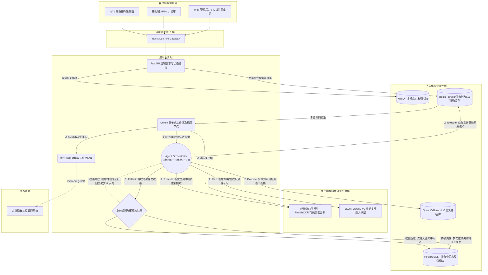

# 智能 PDF 解析解析引擎架构设计指引 (私有化部署)

本系统旨在提供一个高并发、全流程闭环的文档智能解析平台，采用全私有化部署方案，以保障数据的绝对安全。系统原生支持多模态视觉大语言模型（如 Qwen2-VL ），并配套完整的人机协同及持续学习体系。

## 0. 整体系统架构与目录结构

### 0.1 整体分层架构图

以下为系统的全局技术分层架构图，展示了从流量接入、API管控、分布式任务分发、大模型推理，再到数据落地与跨系统推送的完整闭环。



### 0.2 工程源码资源树 (Directory Structure)

基于该系统架构及容器编排规则，系统的总体构建目录如下所示：

```text
construction-record-analysis/
├── docker-compose.yml         # 全局容器集群编排文件 (含vLLM, DB, 中间件, 微服务)
├── .env.example               # 全局环境变量示例 (连接池、Token、挂载路径等)
├── backend/                   # 核心后端微服务 (混合承载 FastAPI 与 Celery)
│   ├── Dockerfile             # 后端应用构建配置
│   ├── requirements.txt       # Python >= 3.10 依赖清单
│   └── src/
│       ├── api/               # Gateway & API 请求层
│       │   ├── routers/       # RESTful API 路由定义 (例如 tasks.py)
│       │   └── main.py        # FastAPI ASGI 应用入口
│       ├── worker/            # 分布式工作流节点层
│       │   ├── tasks.py       # Celery 解析任务入口队列与降级路由
│       │   ├── agent_loop.py  # 核心 Plan-Execute-Reflect(规划-执行-反思) 引擎
│       │   ├── tools/         # Agent动作工具集 (局部裁剪/表格分治提取等)
│       │   ├── validator.py   # 反思层: 强业务规则与幻觉校验器
│       │   └── celery_app.py  # 队列初始化与消息总线绑定
│       ├── core/              # 级联引擎与大模型底层调配
│       │   ├── llm_client.py  # vLLM/OpenAI 接口请求与限流包装
│       │   ├── cascade.py     # OCR纯视觉与vLLM标准流的流转策略
│       │   └── vector.py      # Qdrant/Milvus 向量检索与阈值匹配
│       ├── adapter/           # 跨系统数据转译与通信枢纽
│       │   └── legacy_rpc.py  # 退避重试与 RPC 数据清洗组装
│       └── db/                # 持久层操作
│           ├── models.py      # 任务流转与人工反馈的数据表 DDL 映射
│           └── redis_kv.py    # Level 1 词典散列检索控制
├── scripts/                   # 离线批量任务与自进化调度脚本
│   ├── data_cleaner.py        # 读取 Postgres 反馈池进行 AI 对比及指令集生成
│   └── lora_finetune.sh       # 触发底层大范围参数变动与热加载接口的 Shell 包装
├── models/                    # 模型检查点离线缓存 (供宿主机高优挂载至容器)
│   └── Qwen/                  # 例如子目录: Qwen2-VL-7B-Instruct-AWQ
├── tests/                     # 测试用例目录
│   └── golden_dataset/        # “黄金评测集”防止灾难性遗忘的防线
└── docs/                      # 业务规划与系统架构设计库
    ├── Requirement_Specification.md   # 系统业务需求与规格
    ├── High_Level_Design.md           # 高层系统流转概要设计
    ├── Detailed_Design.md             # 数据库模型、对齐算法及接口详细设计
    └── Architecture_Design.md         # 部署指导、目录工程及私有化基建说明
```

## 1. 硬件与基础设施层

* **计算硬件**: 支持在单节点/多节点的单卡 RTX 4090 (24GB)（建议仅限实验环境）或多卡 L20/L40S 等企业级推理卡上运行核心的多模态提取链路，以规避数据中心消费级显卡的 EULA 合规风险并获得更好的 ECC 显存支持。
* **显存优化**: 通过 vLLM 部署模型并开启 INT4/INT8 (如 AWQ/GPTQ) 量化，将 Qwen2-VL-7B 的显存占用控制在约 6~8GB（INT4）以内，从而为高并发 Batch 推理腾出显存空间。
* **存储架构**:
  * **对象存储 (MinIO)**: 承载原始 PDF、单页切图缓冲、人工重裁剪图片。引入**数据生命周期管理 (Data Lifecycle)**，对于解析成功且人工核对无误的文件暂存区，在 7 天后自动归档或清理切图缓存，降低存储成本。
  * **关系型数据库 (PostgreSQL + PgBouncer)**: 存储解析后的业务结构化数据、处理状态、以及权限记录。引入 `PgBouncer` 等数据库连接池中间件，结合 Celery Worker 端的批量写回 (Batch Insert) 策略，防止高并发下连接数爆满和锁冲突。
  * **向量数据库 (Qdrant/Milvus)**: 对解析出的非标准实体（例如供货商名称、物料编号）进行向量化存储与相似度比对，以实现**柔性主数据对齐 (Schema Alignment)**。

## 2. 核心工作流与高并发批处理

为支持 **一万级 (10k) PDF 批量高并发解析**，系统采用基于 Celery/Redis 的分布式任务队列设计，并深度融合了 Agentic Loop（智能体循环）作为兜底机制：

* **引擎级联与解析分发 (Cascade Pipeline)**: PDF 分页后，首先通过轻量级 CPU/GPU 集群（如 PaddleOCR, LayoutLMv3 等技术栈）负责前置 OCR 和版面坐标切分任务，仅将检测出的复杂表格、手写体、图章等难以解析区域路由调度至 Qwen2-VL 大模型处理，实现算力消耗与响应速度的最优解。
* **规划-执行-反思 (Plan-Execute-Reflect) 循环机制**: 针对大模型单次提取仍失败或产生幻觉的高价值单据，系统在常规级联后串联了一套 Agentic Loop 流程：
  * **Reflect (反思/校验)**: 每次提取后，`Validator` 校验器会依据基建强业务逻辑进行判定（如：总金额是否等于明细累加、必填签名是否缺失）。
  * **Plan (规划)**: 一旦校验失败，系统生成带有负面反馈的纠偏 Prompt（错误日志）。大模型据此感知错误原因，并规划下一步对策（如改变提取策略或调用外部工具）。
  * **Execute (执行)**: Agent 根据策略在沙箱中执行对应工具集动作，如 `Crop_Image`（局部放大裁图防失真）、`Retrieve_Qdrant`（查询专属词典消歧义），获取新上下文后再次提取。
  * **快速失败机制 (Fast-Fail)**: 为了防止 Agent 瞎重试导致算力雪崩，系统不盲目等待 `MaxRetries=3` 耗尽。如果 `Validator` 判定为“存在不可逆破损”、“全白页”或“模型连续两次输出雷同错误（陷于死循环）”，则立即触发 **Fast-Fail 熔断**，直接跳出重试循环，将该文档标记为 `NeedHumanReview`（强制转交人工复核）。
* **高峰期动态降级 (Dynamic Degradation)**:
  * 系统引入 **LLM-as-a-judge** 作为评估裁判。当处于高峰并发且算力瓶颈时，系统会自动缩短提示词或切换至较快的模型。
  * 低于阈值的高风险解析结果不直接阻断流水线，而是通过快速失败机制自动路由进入**人工隔离区 (Manual Quarantine)** 留待非高峰期确认。

## 3. 前端人机协同架构 (Human-in-the-loop)

专为复杂图文、不规则表格涉及的 **三分屏人工审核 UI**:

1. **左侧：原始渲染区**: 展现原始 PDF 页面及自动框选出的对象 BBox 区域。
2. **中侧：二次修正区 (Re-Crop & Sync Scroll)**: 支持滚动双向同步（Sync Scroll）。当用户在右侧点击某项数据时，左侧/中间自动定位到原始区域。支持人工通过鼠标进行框选“重裁剪 (Re-Crop)”。
3. **右侧：结构化数据区**: 展示大模型解析出的 Key-Value JSON 树或表格化数据，供用户人工修改并提交。

## 4. 持续学习与模型自进化

- **建立算力隔离与调度队列**：将推理与训练解耦，用户修正数据先进入 Kafka 消息队列，避免实时抢占推理 GPU 显存。
- **个人隐私保护与合规 (PII 清洗)**：利用规则引擎对送入 LoRA 微调的业务数据进行前置剥离和敏感 PII 消除，保障训练数据集的严谨合规性。
- **配置定时/定量离线微调**：设置每日低谷期（如凌晨）或数据积攒阈值触发 LoRA 训练，并通过 vLLM 的多 LoRA 热插拔能力无缝更新线上模型。
- **部署启发式规则拦截器**：在用户提交修正时，计算原文本与修正文本的编辑距离和长度比，直接拦截恶意删减或无意义乱码。
- **引入LLM异步裁判机制**：部署轻量级判别模型（可与推理复用），对修正内容的语法逻辑与工程合理性进行二次前置自动评分。
- **构建黄金评测集（Golden Dataset）回归拦截**：新微调的 LoRA 模型在灰度上线前，必须在预设的高质量测试集上进行自动化打分，分数下降则自动废弃并报警，防止灾难性遗忘。

---

## 附录：部署指南 - 本地下载 Qwen2-VL-7B 及推理挂载说明

系统通过 vLLM 加载并托管 Qwen2-VL 权重。

**步骤 1：下载权重至宿主机**
在安装了 `huggingface-cli` 或者是 `modelscope` 客户端的宿主机上执行下载操作（推荐使用 INT4 量化版以节省显存）：

```bash
# 创建统一的模型挂载目录
mkdir -p /data/models/Qwen
cd /data/models

# 使用 modelscope 境内加速下载
modelscope download --model qwen/Qwen2-VL-7B-Instruct-AWQ --local_dir ./Qwen/Qwen2-VL-7B-Instruct-AWQ
```

**步骤 2：在 vLLM 容器内挂载模型**
在 `docker-compose.yml` 设置中，需完成主机 `/data/models` 映射至容器内部的 `/models`。
启动时设置 `--model /models/Qwen/Qwen2-VL-7B-Instruct-AWQ --quantization awq`。您可以参考 `docker-compose.yml` 文件中对 `vllm` 服务的具体定义。
