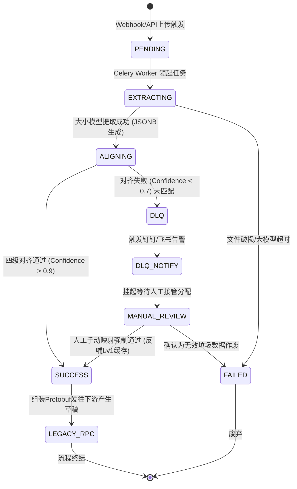
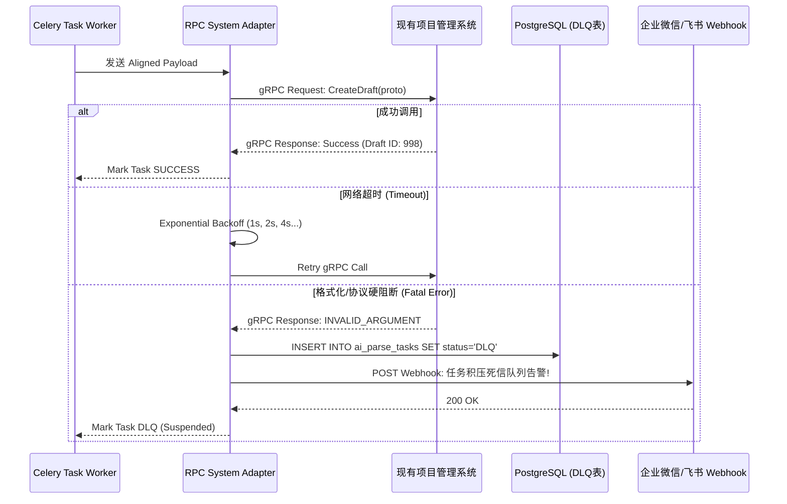

# 施工记录智能分析系统 - 详细设计说明书 (Detailed Design)

## 1. 技术栈选型与理由

| 技术栈                  | 版本/型号  | 选型理由                                                                                                                                     |
| :---------------------- | :--------- | :------------------------------------------------------------------------------------------------------------------------------------------- |
| **Python**        | `3.10+`  | 利用 Python 3.10 的 Structural Pattern Matching (模式匹配 `match-case`) 极大简化多模态数据解析和不同厂商遗留系统返回体嵌套结构的解析代码。 |
| **PostgreSQL**    | `15+`    | 充分利用其强大的 `JSONB` 字段类型处理非结构化和半结构化抽取的中间态数据；支持 GIN 索引提升 JSON 内部字段查询效率；且稳定可靠支持高并发。   |
| **Redis**         | `7.0+`   | 作为 Celery Broker、分布式锁（Redlock）和 Level 1 内存精确字典缓存（O(1) 复杂度）。Redis 7 性能更好，ACL 控制更细。                          |
| **Celery**        | `5.3+`   | 业界成熟的 Python 异步任务队列，支持复杂的路由机制（Routing）、任务重试 (Retry)、并发控制与流控限制（Rate Limiting，保护 vLLM 限流）。       |
| **Qdrant/Milvus** | `Qdrant` | (原架构基于Qdrant/Milvus)，轻量高效支持 Restful/gRPC 的向量数据库，用于 Level 3 语义对齐。                                                   |
| **vLLM**          | `0.4.x+` | 专为大语言模型量身打造的高吞吐推理引擎（PagedAttention），能够大幅降低 GPU 显存碎片，为 Qwen2-VL 多并发处理提供硬件级支撑。                  |

## 2. 数据库物理模型设计 (DDL)

为了记录解析主流程、对齐情况和持续进化机制，PostgreSQL 数据库应当包含以下核心表结构：

```sql
-- 1. 任务元数据表 (Task/Pipeline 元信息)
CREATE TABLE ai_parse_tasks (
    task_id UUID PRIMARY KEY DEFAULT gen_random_uuid(),
    biz_flow_id VARCHAR(128) NOT NULL, -- 业务流水号
    source_type VARCHAR(20) NOT NULL, -- image / audio / pdf
    file_url VARCHAR(512) NOT NULL, -- MinIO ObjectID
    status VARCHAR(20) DEFAULT 'PENDING', -- PENDING, EXTRACTING, ALIGNING, SUCCESS, DLQ, FAILED
    extracted_json JSONB, -- AI 原始提取的非标数据
    aligned_json JSONB, -- 强制对齐后的结构化数据
    target_legacy_id VARCHAR(64), -- 下游系统生成的草稿ID
    retry_count INT DEFAULT 0,
    error_message TEXT,
    created_at TIMESTAMP WITH TIME ZONE DEFAULT CURRENT_TIMESTAMP,
    updated_at TIMESTAMP WITH TIME ZONE DEFAULT CURRENT_TIMESTAMP
);
CREATE INDEX idx_task_status ON ai_parse_tasks(status);

-- 2. 实体对齐日志表 (用于追溯四级对齐耗时与级别)
CREATE TABLE entity_alignment_logs (
    log_id BIGSERIAL PRIMARY KEY,
    task_id UUID REFERENCES ai_parse_tasks(task_id),
    original_text VARCHAR(255) NOT NULL, -- AI提取的原文字(如"打灰")
    aligned_id VARCHAR(64), -- 对齐后的唯一主键(如10024)
    aligned_name VARCHAR(255), -- 对齐后的标准词(如"混凝土浇筑")
    match_level INT NOT NULL, -- 1:Redis精确, 2:TF-IDF, 3:向量语义, 4:人工映射
    confidence NUMERIC(5, 4), -- 相似度得分 / 置信度
    created_at TIMESTAMP WITH TIME ZONE DEFAULT CURRENT_TIMESTAMP
);

-- 3. 人机协同微调回流池 (Feedback Loop)
CREATE TABLE lora_feedback_pool (
    feedback_id BIGSERIAL PRIMARY KEY,
    task_id UUID REFERENCES ai_parse_tasks(task_id),
    ai_predicted_json JSONB NOT NULL,
    human_corrected_json JSONB NOT NULL,
    is_processed BOOLEAN DEFAULT FALSE, -- 是否已被用于微调离线集
    created_at TIMESTAMP WITH TIME ZONE DEFAULT CURRENT_TIMESTAMP
);
```

## 3. 业务组件流转状态机与时序图

### 3.1 核心状态流转图 (State Machine)



### 3.2 遗留系统集成适配时序图 (Adapter)



## 4. 接口规范与 Protobuf 契约

### 4.1 前端网关 RESTful API 规范

前端设备（如小程序、Web端）统一通过 API Gateway 提交解析任务，采用标准的 RESTful 风格，关键接口如下：

- **任务提交接口 (Create Task)**

  - `POST /api/v1/tasks`
  - **请求体 (JSON):**
    ```json
    {
      "biz_flow_id": "SN-20260305-1001",
      "source_type": "image",
      "file_url": "s3://minio-bucket/uploads/2026/03/site_pano.jpg",
      "callback_url": "https://biz-system/api/webhook/task-done"
    }
    ```
  - **响应体 (202 Accepted):** 返回 `task_id` 和当前状态 `PENDING`。
- **任务状态查询 (Get Task Status)**

  - `GET /api/v1/tasks/{task_id}`
  - **响应:** 包含 `status` (如 EXTRACTING, SUCCESS)、`aligned_json` 等数据。
- **人工纠编提交 (Submit Human Correction)**

  - `PUT /api/v1/tasks/{task_id}/correction`
  - 将人工在工作台中修正的 JSON 覆盖提交，改变状态为 SUCCESS 并回流 Feedback 池。

### 4.2 RPC System Adapter 协议设计 (`sync_draft.proto`)

该 Protobuf 将作为微服务进程间的通信契约，强制约定向遗留系统推送数据的格式。增加了重试与重连配置的标准化定义。

```protobuf
syntax = "proto3";
package construction.record;

message RetryPolicy {
  int32 max_attempts = 1;       // 最大重试次数 (默认 3)
  int32 initial_backoff_ms = 2; // 初始退避时间毫秒 (如 1000)
  int32 max_backoff_ms = 3;     // 最大退避时间毫秒 (如 10000)
  float backoff_multiplier = 4; // 退避乘数 (如 2.0)
}

message CreateRecordDraftRequest {
  string task_flow_id = 1;      // 幂等性防重流水号ID
  string resource_url = 2;      // MinIO 图片/PDF 长期链接
  string record_type = 3;       // 记录分类 (安全/质量/进度)
  
  // 以下为必须被对齐框架强制转换的业务外键
  int64 worksite_id = 4;        // [外键] 标准工点/标段ID
  int64 process_id = 5;         // [外键] 标准化作业工序ID
  string reporter_emp_id = 6;   // [外键] 人员库工号
  
  // AI 提取的其他非标字段 (透传)
  string raw_metadata = 7;      // JSON String (GPS,时间戳)
  string ai_summary = 8;        // 模型给出的隐患摘要
  
  // 渠道级别的重试策略
  RetryPolicy retry_policy = 9; 
}

message CreateRecordDraftResponse {
  bool success = 1;
  int64 draft_record_id = 2;    // 旧系统返回的新建草案主键
  string error_message = 3;
  bool is_retryable = 4;        // 提示发送方该错误是否属于可重试的瞬时网络/限流错误
}
```

## 5. 四阶段强制业务 ID 对齐实现细节

在将大模型提取出的“口语化”工地词汇映射到标准 ID（如 `worksite_id`）时：

1. **Level 1 (TF-IDF & 编辑距离结合打分)**:
   - 算法结合了字面相似性与词频重要性。
   - 计算 AI 提取短语和 PostgreSQL 中维护的所有标准业务词的 Jaro-Winkler 距离（偏向短文本拼写纠错或字面相似）与 TF-IDF 余弦相似度（捕获核心业务词汇重合度）。
   - 代码级权重分配逻辑: `Score = 0.6 * JaroWinkler + 0.4 * TFIDF_CosSim`。给 Jaro-Winkler 分配 0.6 是因为工程标准件名称长度较短且核心错字率较高；给 TF-IDF 分配 0.4 保证了诸如“混凝土”这样高频词的IDF权重被惩罚，从而突显“C30”这些低频关键信息。
   - 若 `Score >= 0.90`，强制采信。
2. **Level 2 (Qdrant/Milvus 向量打分)**:
   - 集合(Collection): `worksite_embeddings`
   - 维度: 例如 `1024` (依赖于轻量 embedding 模型如 BGE-m3)
   - 索引设置 (Index Settings): 采用 `HNSW` (Hierarchical Navigable Small World) 图索引以保障极高召回率和查询性能；距离度量 (Metric) 采用内积 `IP` (Inner Product, 需归一化嵌入向量) 或 `L2` 距离，优先推荐 `IP` 加快计算。
   - 召回: 查询 `top_k=3`，若最高项内积打分超阈值（等价于 CosSim >= 0.85），采信此结果。
3. **Level 3 (DLQ 死信与 Webhook 告警)**:
   - 若以上全部低于阈值，抛出 `AlignmentFailedException`，任务状态切至 `DLQ`。
   - 系统捕获异常并通过配置的 `WEBHOOK_URL` 给值班管理员发送钉钉/飞书卡片消息:
     *“⚠️【对齐失败】AI提取项: '左沟沿浇筑' 无法匹配业务库。请及时至管理后台人工干预映射。 TaskID: xxx”*

## 6. 自带闭环的持续平台与 LoRA 热更新

### 6.1 Feedback Table 结构设计与人工纠编流水

DDL 中定义了 `lora_feedback_pool`，其具体字段含义与数据约束如下：

- `ai_predicted_json`: 记录模型输出的原始提取对齐结果（含置信度等元数据）。
- `human_corrected_json`: 记录审核员在前端后台纠正后的最终事实 (Ground Truth)。
- 同时配合记录表单 ID、创建时间以及处理标签 `is_processed` 防止重复训练。

### 6.2 数据清洗逻辑脚本 (Data Cleaning Pipeline)

触发时机：遗留系统用户每天下班后审核完当日草稿单据，系统在凌晨 `02:00` 触发批处理清洗脚本。主要逻辑(伪代码)如下：

```python
def nightly_data_cleaning_job():
    # 1. 抽取未处理的错判样本
    records = db.query("SELECT * FROM lora_feedback_pool WHERE is_processed = FALSE")
  
    dataset = []
    for row in records:
        # 2. 对比结构化差异，过滤无意义噪音 (如仅空白字符调整)
        if diff_is_structural(row.ai_predicted_json, row.human_corrected_json):
            # 3. 构造 Instruction Tuning (指令微调) 标准格式
            sample = {
                "instruction": "请从下述工程施工记录中提取专业信息并输出JSON结构",
                "input": extract_raw_text(row.task_id),
                "output": json.dumps(row.human_corrected_json, ensure_ascii=False)
            }
            dataset.append(sample)
  
    # 4. 写入 JSONL 训练文件并标记已被处理
    save_to_jsonl(dataset, "s3://ml-ops/train-data/latest.jsonl")
    db.execute("UPDATE lora_feedback_pool SET is_processed = TRUE WHERE feedback_id IN (...)")
```

### 6.3 LoRA 积累触发与 vLLM 动态热加载 (Hot-Loading)

1. **LoRA 积累触发**:
   - 当清洗后积累的高质量样本数量超过 `10,000` 条时，触发 GPU 训练节点执行大语言模型 LoRA 微调（基于 PEFT / Unsloth 框架加速，产出新的适配器权重，耗时通常几小时）。
2. **热更新机制 (vLLM Hot-Loading)**:
   - 训练产生新的 Adapter Weights 目录，上传至模型仓库 (例如 `/models/adapters/lora-v1.2`)。
   - vLLM 提供了原生的多 LoRA 动态插拔和请求路由支持。系统在探测到新权重后，无需重启推理引擎。
   - **加载指令(命令/API示例)**:
     - 在启动 vLLM 时本身需开启支持 `--enable-lora` 及预留 `--max-loras 2`。
     - 为了热加载，可直接向 vLLM 的 API server 发送请求（如果是兼容 OpenAI 的 `/v1/chat/completions` API）：
       ```json
       {
         "model": "qwen2-vl-base",
         "messages": [{"role": "user", "content": "..."}],
         "dynamic_lora_request": {
           "lora_name": "lora_v1_2",
           "lora_path": "s3://models/adapters/lora-v1.2"
         }
       }
       ```
     - 或者通过专属 Admin API 将新的 LoRA 注册进显存调度池。下次推理请求指定 `lora_name` 即可利用最新业务知识结构进行提取。
