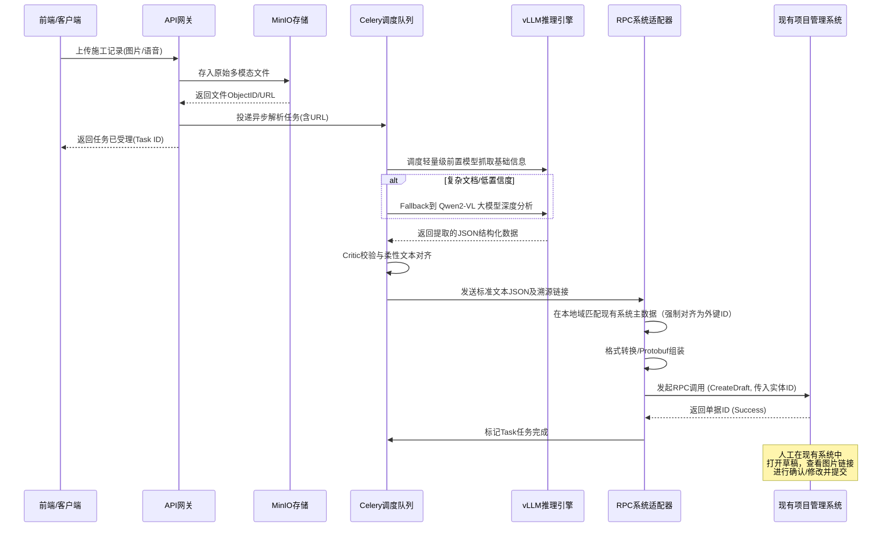

# 施工记录智能分析系统 - 概要设计说明书 (High-Level Design)

## 1. 概述

本系统旨在通过深度学习与大模型技术，针对基建施工过程中产生的大量多模态数据（图片、录音、PDF/Excel图纸文档等）进行自动化解析、结构化提取与校验。系统作为一个“AI数据代理干线”，将提取的结果通过 **RPC系统适配器** 无缝推送到现有的项目管理系统中生成“草稿”，由人工进行极速复核，从而实现“AI尽力提取 + 人工极速复核”的闭环，最终通过人机协同数据驱动大模型持续进化（LoRA微调）。

## 2. 核心功能模块划分

### 2.1 多模态数据接入与预处理模块

* **职责**：提供统一的API网关，接收来自前端设备（手机、Web、IoT硬件）的多源数据上传。
* **动作**：语音降噪与ASR转写、图片透视矫正与防伪校验（GPS/时间戳/水印）、长文档（PDF）分页切割。并将媒体实体存入 **MinIO** 对象存储。

### 2.2 高并发批处理调度模块

* **职责**：应对海量历史卷宗和早晚高峰期的数据上传爆发。
* **动作**：基于 **Redis + Celery** 实现分布式任务队列。支持大模型API的速率控制与拥塞控制。具备动态降级能力（在GPU显存告警时，调度轻量级 OCR/端侧模型进行粗粒度处理）。

### 2.3 AI解析与大小模型级联引擎

* **职责**：大模型与小模型的动态调度组合，执行核心的认知推理与业务主数据抽取。
* **动作**：
  1. **级联调度策略**：首先使用轻量级前置模型（如 PaddleOCR、LayoutLMv3 等专用端侧/小模型）进行基础图文提取和版面分析，快速处理常规数据。
  2. **复杂文档预判与大模型Fallback机制**：系统通过规则与轻量模型粗筛，一旦满足以下**复杂文档判断标准**，即 Fallback 流转至 **vLLM 框架驱动的 Qwen2-VL 大体量模型** 进行深层感知与语义理解：
     * **置信度不达标**：轻量级 OCR 识别字符或前端实体的平均置信度（Confidence Score）低于系统设定的下限安全红线（例如 `< 85%`）。
     * **版面极度不规则**：包含文字流严重混排、多层嵌套/无框线组成的非标表格，以及庞杂且带有各类参数的建筑 CAD 结构图或竣工图。
     * **高密度或潦草手写体**：预判分类发现文档中充斥大篇幅连笔手写记事、现场旁注批注、或是文字被多重印章、指印严重遮盖的场景。
     * **物理损伤与特征破坏介质**：原始影像存在高强度逆光、剧烈透视变形扭曲、或部分污渍遮挡，单凭局部版面分析已面临断层。此时需利用大模型强大的多尺寸分辨率感知能力进行**特征还原与上下文精准提取**。*(注：为绝对保证工程数据的准确性与严谨性，模型提示词中须加入强约束，**严禁模型进行任何“脑补”或虚构**；对于确因物理损坏无法辨认的字段，必须输出 `null` 或打上“需人工核实”的预警标签)*。
  3. **规划-执行-反思 (Plan-Execute-Reflect) 智能体循环机制**：针对大模型单次提取依然失败或逻辑不自洽的高价值复杂单据，系统引入 Agent 循环进行自我纠偏：
     * **Reflect (反思校验)**：提取后立即执行基于基建业务规则的强校验（如：金额计算逻辑、必填审批人签字是否存在）。
     * **Plan (规划重试)**：若校验未通过，携带具体的“报错日志（Negative Feedback）”生成再思考提示词，引导大模型分析失败原因，并规划下一步的工具调用路径。
     * **Execute (工具执行)**：Agent 通过沙箱调用特定的外部工具集（如：局部图片放大裁剪 `Crop_Image`、逐行表格提取、向量知识库检索 `Retrieve_KV`）获取补充上下文再次进行精准提取。
     * **快速失败 (Fast-Fail) 熔断机制**：为避免陷入重试死循环并保护 GPU 算力成本，不需要盲目等待最大重试次数（`Max_Retries`）耗尽。若系统判定存在“物理损坏导致彻底无法辨认”、“连续输出雷同错误”、“内容全空白”等边界条件，立即触发 Fast-Fail 熔断，直接阻断循环，将其降级并转入人工复核队列。
  4. **柔性数据对齐与校验规则**：为解决现场称呼与标准台账不一致的问题（如“打灰”对齐至“混凝土浇筑”），系统采用**向量检索柔性对齐**机制。具体过程为：
     * **词典向量化**：预先将工程主数据（标准工序、岗位、构件部位）通过 Embedding 模型转化为稠密向量存入 Qdrant/Milvus。
     * **相似度召回与判定**：对 AI 提取出的“非标准实体”提取向量级特征，并在向量库中查询 Top-K。如果最高相似度 $\ge$ `0.85`（例如），则安全映射替换为标准实体；如果在 `0.7` 到 `0.85` 之间，则保留原词但打上“待核对”黄灯标签；如果 $< 0.7$，则作为离群值原样输出。
     * **Critic多维扫描**：结合 Critic 模型进行安全与质量熔断扫描，生成最终业务置信度打分。

### 2.4 现有系统适配器 (System Adapter) 与强制业务对齐

* **职责**：连接新建AI系统与现有企业项目管理（表单录入）系统的核心枢纽，并负责底层数据标识的强引用转换。
* **动作**：
  1. **现有系统基础数据同步**：系统定期（或通过 Webhook）从现有系统获取最新的主数据字典映射（如：工点树形结构、分部分项工程列表及其对应的外部唯一主键/ID）。
  2. **强制业务ID对齐 (ID Alignment)**：作为推送前的必须环节，拦截接收到的标准 JSON。将文本级别的业务字段（例如AI提取的工点名称为“简易算量隧道左幅”）与同步的基础数据匹配，精准映射为下游必需的数据库外键（如 `worksite_id: 10024`）。
     * **四级匹配流水线**：适配器内部嵌有一套严谨的对齐策略：1) **Redis 精确查找** (规范输入 O(1) 命中) -> 2) **文本模糊相似度** (编辑距离计算防少字/错字) -> 3) **语义向量兜底** (多用于别名或施工俗称搜索) -> 4) **人工异常挂起** (阈值全未达标时拒绝直接落库，转人工选择并反哺)。
  3. **协议转换与草稿生成**：作为 Celery 队列的最后消费环节，将转换了引用 ID 的结构化 JSON 及 MinIO 中的媒体链接地址，通过 **RPC协议** 组装为现有系统可识别的 Payload，在老系统中直接创建并关联好层级关系的“草稿”状态单据。

### 2.5 人机协同与持续学习模块

* **职责**：业务最终闭环与 AI 能效提升的“飞轮”。
* **动作**：在现有系统中，人工对草稿进行快速比对与修改。修改后的“终态数据”异步回流到 AI 系统的训练缓冲池。经过隐私脱敏与数据清洗，定期触发 **LoRA 离线微调**，自动化闭环更新模型权重。

## 3. 系统架构与组件流转状态

* **MinIO (对象存储)**：存储所有原始上传的图文、PDF切图及录音文件，基于生命周期策略定时清理临时分析缓存，仅保留具有业务溯源价值的唯一对象，返回 CDN/内网直链。
* **PostgreSQL (关系数据库)**：存储系统的结构化提取结果（未推送到现有系统前）、批处理任务的元数据、任务状态机流转记录（Pending -> Processing -> Success/Failed），以及用户的微调数据集管理信息。
* **Redis + Celery (中间件/调度)**：Redis 用作 Celery 的 Broker 和 Result Backend，同时提供分布式锁和全局并发计数器，确保提交给 vLLM 的高并发请求处于 GPU 显存的安全水位之内。
* **大小模型级联推理服务 (推理引擎)**：
  * **轻量级模型集群**：如 PaddleOCR / LayoutLM 等轻后端，负责处理普通图文提取，减少大模型算力浪费。
  * **vLLM**：GPU 计算节点上的核心推理服务，加载量化后的多模态大模型权重（支持 PagedAttention 和连续批处理 Qwen2-VL 等），专用于承接大体量、复杂长尾任务。无状态运行，通过 API 暴露给内部 Worker。

## 4. 关键数据流时序图 (Mermaid)

## 5. 现有系统适配器 (System Adapter) RPC 设计详述

为了保证高效、可靠地跨系统集成，RPC 系统适配器的设计需遵循以下规范：

1. **接口契约 (Protobuf)**：定义强类型的 `.proto` 文件，对 AI 输出的关键字段（如时间、位置、工序、人员要素）进行严格映射，确保数据类型的向后兼容性。
2. **连接复用与线程安全**：在 Celery Worker 进程生命周期中维护 RPC Channel 的单例或连接池结构，避免频繁建立 TCP/TLS 连接引发的网络开销。
3. **超时控制 (Timeout)**：为 RPC 调用设置严格的 Deadline（如 3-5 秒）。防止下游旧系统堆积导致 Celery Worker 被挂起耗尽。
4. **异常重试与死信队列 (DLQ)**：
   * 网络抖动报错（如 `UNAVAILABLE`, `DEADLINE_EXCEEDED`）执行指数退避重试 (Exponential Backoff)。
   * 格式错误报错或达到最大重试次数，将任务写入 PostgreSQL 的死信队列表（Dead Letter Queue），触发人工告警干预。
5. **调用幂等性 (Idempotency)**：通过在上游 RPC 请求中加入全局统一的 `Task_ID`，现有系统端需实现在该流水号下的防重插入逻辑，防止网络重试造成草稿单据的重复创建。

## 6. 四阶段强制业务ID对齐流程详述

为确保AI提取结果不携带“自然语言的随意性”去污染现有系统数据库，System Adapter 内部对关键外键（工区、构件名、操作人等）的映射必须经过严格的 **四级漏斗匹配机制（Multi-stage Matching Pipeline）**：

1. **Level 1 - 复合文本相似度过滤 (TF-IDF + Levenshtein)**
   * **动作**：面对偶尔的少字、错字。提取候选词集并使用 TF-IDF 以及 编辑距离（Levenshtein/Jaro-Winkler）算法做交替验证。只有当相似度 $\ge$ `0.9` （例如）时才自动取用对应外键 ID。
2. **Level 2 - 语义向量搜索兜底 (Semantic Vector Search)**
   * **动作**：面对字面量完全不同，但实际所指一致的“俗称”问题（比如AI提取为“一号标段防洪墙”，系统名为“高程堤-1区”）。通过本地轻量级 Embedding 模型将文本转化为向量，往 Milvus 等向量库请求 Top 3，根据余弦阈值做最后一搏判断。
3. **Level 3 - 未决挂起与人机反馈飞轮 (Human-in-the-Loop)**
   * **动作**：如果前三关的置信度都不高，为保护数据绝对清洁，系统**决不允许**写入虚假 ID。这条数据会被标记为 `Unmapped`，推至前端异常队列由**人工在下拉框中接管**。
   * **飞轮闭环**：当人工手动将那句俗称映射到特定的外键 ID 后。系统同时将 `{"俗称": ID}` 这条全新的 Key-Value 下发并常驻在 Level 1 的 Redis 精简字典中，从而让之后同口径表述彻底绕绝所有步骤直接精确命中。

## 7. 自带闭环的持续进化 (Self-Evolution)

1. **数据回流 (Feedback Data)**：现有系统一旦审核通过，将人工修改后的终态表单数据（正确标签）与对应的 Task ID 通过回调 API 或消息中间件发回 AI 系统。
2. **清洗与脱敏**：清洗程序对比“AI预测值”与“人工终态值”，计算 Error 偏差。对于有偏差的数据，剥离敏感信息存入“高质量训练样本集”。
3. **微调触发**：当达到预设的样本量阈值或周期时间，系统启动后台任务，使用预处理后的样本进行大模型 LoRA (Low-Rank Adaptation) 参数微调。
4. **模型热更新**：经过黄金测试集自动评测通过后，将最新的 LoRA 权重动态挂载（或重启部署）至 vLLM 引擎，使系统在新项目现场的识别率逐步提升。
